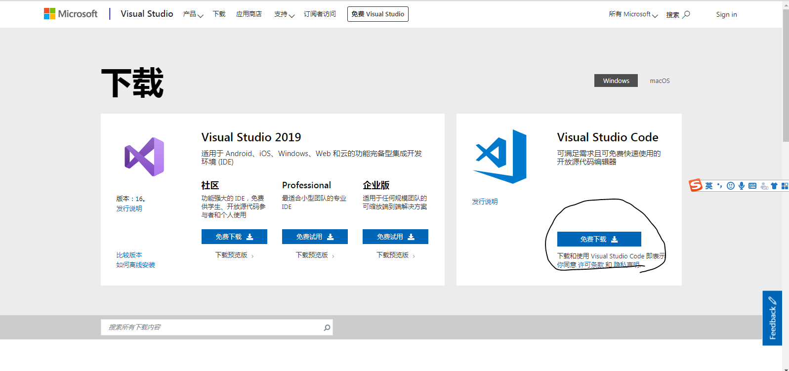
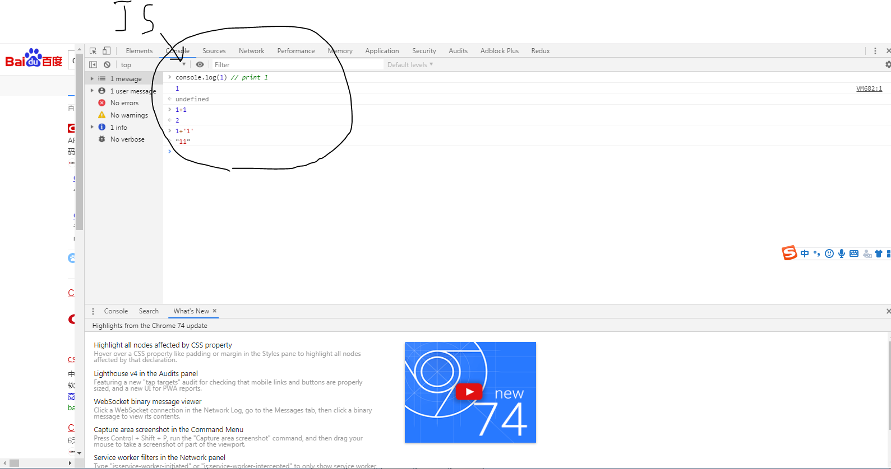
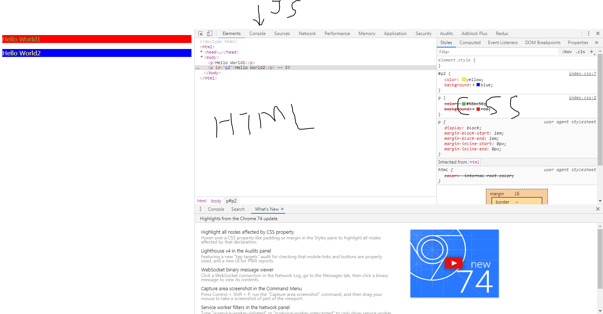
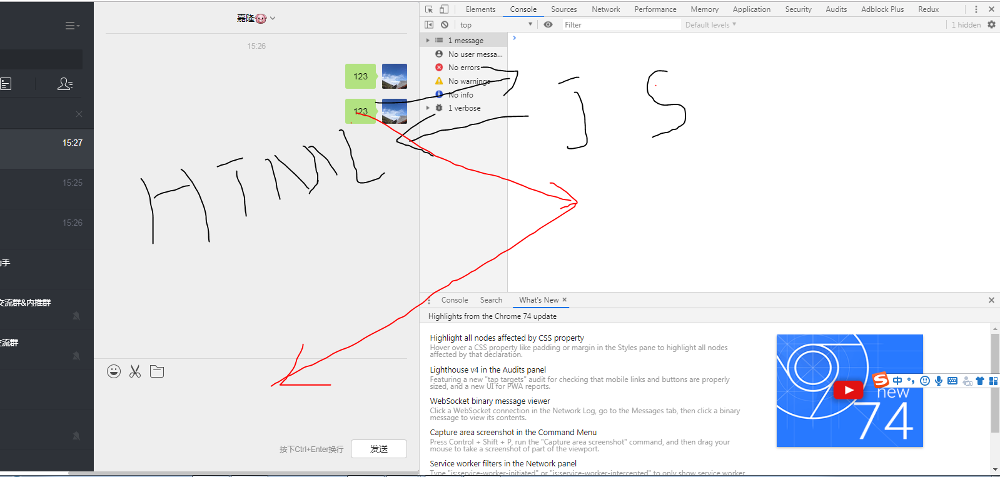

# 开发工具

> Visual Studio Code

[官网下载地址](https://visualstudio.microsoft.com/zh-hans/downloads/)



# 前端课程

- HTML
- CSS
- JS

# 后端课程

- [NodeJS](http://nodejs.cn/download/) (外挂，木马，暴力破解，爬虫)

# 浏览器

Chrome(谷歌浏览器)，适合前端开发


# 写第一个Hello World

- 创建一个文件`xxx.html`以`.html`后缀的文件，可以使用记事本新建文件，然后更改其后缀名`.html`


- 用VSC或者记事本修改`xxx.html`，可以修改为一下内容
```html
<!DOCTYPE html>
<html>
    <head>
        <title>标题名字</title>
    </head>
    <body>
        <p>Hello World</p>
    </body>
</html>
```
|标签|含义|
|-|-|
|`<!DOCTYPE html>`|document type文档的类型|
|`<html>`|写入`html`的内容区域|
|`<head>`|`html`头部区域，定义标题的名字，你的网站的图标|
|`<body>`|`html`内容区域，当浏览器截入该文件，用户看到的内容|
|`<p>`|`p`显示一段文本内容|

# CSS样式

修饰`html`的内容，你可以对你的`html`进行上颜色，加粗，放大，设置背景颜色，字体大小，字体类型

- 创建一个文件`xxx.css`以`.css`后缀的文件，可以使用记事本新建文件，然后更改其后缀名`.css`
```css
p {
    color: #58bc58;
    background: red;
}
```

# JS逻辑

在控制台里面运行代码，如下图



它在浏览器背后默默地执行

更改样式
```js
// 取值
document.getElementById("p2").style.color
// 改值
document.getElementById("p2").style.color="red"
```
更改标签的文字内容
```js
// 取值
document.getElementById("p2").innerHTML
// 改值
document.getElementById("p2").innerHTML="red"
```
获取输入框的值
```js
// 取值
document.getElementById("p2").value
// 改值
document.getElementById("p2").value="red"
```

# 利用浏览器的控制面板来查看代码

你再谷歌浏览器里面对着界面内容，右键选择-> 检查，会出现以下界面

你可以在这里更改`html`和`css`，其实你会看到页面所看不到一些内容，根据修改的源代码，对页面进行增删查改



# 微信自动回复



- 获取`HTML`的内容，然后交给`JS`判断

```js
document.getElementById("id")
document.querySelector("#id")
document.querySelector(".class")
// 获取class="js_message_plain"的所有节点
document.querySelectorAll(".js_message_plain")

document.querySelector("#editArea").innerHTML="ajsdlkjasld"

document.querySelectorAll(".js_message_plain")[2].innerText
```

```js
var appElement = angular.element("[ng-controller='chatSenderController']")
var $scope = angular.element(appElement).scope()
$scope.editAreaCtn = "yaoyao"
$scope.sendTextMessage()
```

- `JS`设置回复框内容，然后自动点击发送

# 定时器

> setInterval(函数，毫秒)

会每过多少毫秒就会执行一次函数
```js
setInterval(function(){
    console.log(1)
},1000)
```
在微信控制台里面添加该代码，就会给过一秒发送一条文本
```js
setInterval(function(){
    var appElement = angular.element("[ng-controller='chatSenderController']")
    var $scope = angular.element(appElement).scope()
    $scope.editAreaCtn = "yaoyao"
    $scope.sendTextMessage()
},1000)
```
每一秒监听页面的第三条信息
```js
setInterval(function(){
	var message=document.querySelectorAll(".js_message_plain")[2].innerText
	console.log(message)
},1000)
```

```js
setInterval(function(){
	var message=document.querySelectorAll(".js_message_plain")[2].innerText
	console.log(message)
},1000)
```

获取信息列表的长度最后的一条，也就是最新的一条

只要最后一条信息没变化（长度没变化），那么定时器的逻辑就不执行，不打印（只打印），只能回复一次

防止撤回
```js
setInterval(function(){
    var message=document.querySelectorAll(".js_message_plain")
    var messageLast = message[message.length-1].innerText
    console.log(messageLast)
}, 1000)
```
```js
// 上一个长度 初始化的信息列表
var messageLengthLast = 0;
setInterval(function(){
    var message=document.querySelectorAll(".js_message_plain")
    // 最新的长度 下一个信息长度
    if(message.length!==messageLengthLast){
        var messageLast = message[message.length-1].innerText
        messageLengthLast = message.length
        console.log(messageLast)
        
        // 回复信息
        var appElement = angular.element("[ng-controller='chatSenderController']")
        var $scope = angular.element(appElement).scope()
        if(messageLast==='你好'){
            $scope.editAreaCtn = "你也好"    
        }else{
            $scope.editAreaCtn = "我很好" 
        }
        $scope.sendTextMessage()
    }
}, 1000)
```

```js
var num = 0;
setInterval(function(){
	// 监听每一条新的聊天记录
	var messages = document.querySelectorAll(".js_message_plain")
	// 获取信息的长度
	var length = messages.length
	// 这个if里面的逻辑是有新消息我才进行回复
	if(num!=length){
		//num和length不一样的话，打印新的消息
		console.log(messages[length-1].innerHTML)
		if(messages[length-1].innerHTML=='你好'){
			var appElement = document.querySelector('[ng-controller=chatSenderController]');
			var $scope = angular.element(appElement).scope();
			$scope.editAreaCtn = "你也好啊";
			$scope.sendTextMessage();
		}else if(messages[length-1].innerHTML=='今晚搞不搞'){
			var appElement = document.querySelector('[ng-controller=chatSenderController]');
			var $scope = angular.element(appElement).scope();
			$scope.editAreaCtn = "搞啊";
			$scope.sendTextMessage();
		}
		num = document.querySelectorAll(".js_message_plain").length
	}
},1000)
```

