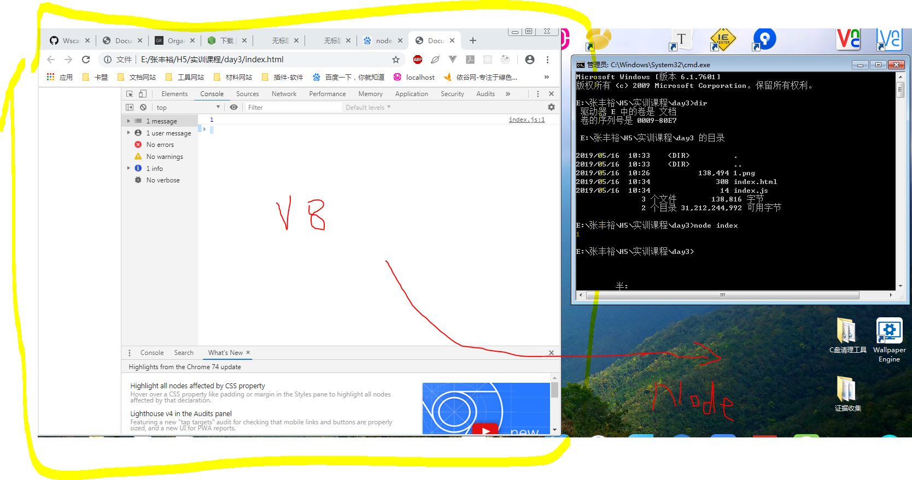
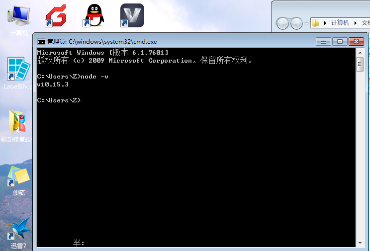

# NodeJS

JavaScript是世界上全栈语言(渗透前后端)

Java服务端，Android(Java)全栈语言

Python

NodeJS



- 运行JS平台，让JS可以渗透到后端(服务端)
- 其实就是谷歌浏览器运行JS的核心引擎拿出来，安装在其他系统平台上面

[NodeJS安装](http://nodejs.cn/download/)

# 打开命令行



```sh
node -v
```
如果出现版本号，证明`node`安装成功


新建一个`index.js`，然后需要用一份`index.html`加载，JS才可以被执行

```js
console.log(1)
```
打开命令行
```sh
node index
node index.js # or
```

# 计算机网络

- 三次握手，四次挥手 TCP/IP协议 OSI七层模型
- 请求，响应，请求体，响应体，状态码，字节码

# 文档

[Node官方API文档](http://nodejs.cn/api/)

我们使用了`fs`模块对文件进行增删查改

# fs

读取的文件不一定是文本文件，有可能是音频视频，图片，这些文件无法用字符串描述，二进制
```js
var fs = require('fs');
fs.readFile('./abc.txt',function(err,data){
    console.log(data.toString()); // 二进制
})
```

# http

调用`http`实现蜘蛛爬虫,`http`是`node`内置的模块,`npm`应用商店
```js
// http请求模块
var http = require('http');
// 文件系统
var fs = require('fs');
// 如果请求成功，则在回调函数里面返回该内容
http.get('http://www.umei.cc/tags/meinvyouwu.htm', function (res) {
    // console.log(res)
    // response 响应，响应回来的数据流 二进制格式回来
    res.setEncoding('utf8');
    // 新的数据，空的容器
    var rawData = '';
    // 监听数据回来 chunk片段
    res.on('data', (chunk) => { 
        rawData = rawData + chunk; 
    });
    // 监听结束
    res.on('end', () => {
        fs.writeFile('./beauty.html',rawData, function(){});
        console.log(rawData);
    })
})
```

# 正则匹配图片路径

> /正则表达式主体/修饰符(可选)

/ { 
        rawData = rawData + chunk; 
    });

    // 监听结束
    res.on('end', () => {
        fs.writeFile('./beauty.html',rawData, function(){});
        // 使用cheerio加载html解构，然后把它赋给$符号
        var $ = cheerio.load(rawData);
        $('img').each(function(index,ele){
            console.log($(ele).attr('src'));
            var img = $(ele).attr('src');
            request(img).pipe(fs.createWriteStream(`./img/${index}.png`))
        });
    })
})
```

