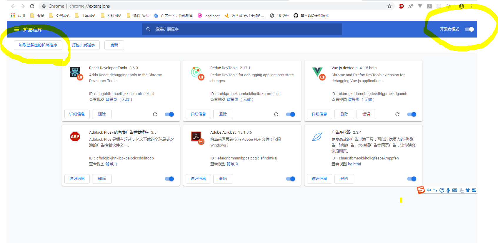

# 插件

> Chrome插件是一个用Web技术开发、用来增强浏览器功能的软件，它其实就是一个由HTML、CSS、JS、图片等资源组成的一个.crx后缀的压缩包.

# manifest.json

描述该插件的一些情况，所有的注入脚本都放在`content_scripts`里面，当我们加载完页面后，会执行这段注入脚本
```json
{
    // 清单文件的版本，这个必须写，而且必须是2
    "manifest_version": 2,
    // 插件的名称
    "name": "demo",
    // 插件的版本
    "version": "6.6.6",
    // 插件描述
    "description": "简单的Chrome扩展demo，会给你很多很多惊喜",
    // 图标，一般偷懒全部用一个尺寸的也没问题
    // 会一直常驻的后台JS或后台页面
    "background": {
        // 2种指定方式，如果指定JS，那么会自动生成一个背景页
        "page": "background.html"
        //"scripts": ["js/background.js"]
    },
    // 需要直接注入页面的JS
    "content_scripts": [
        {
            // "matches": ["http://*/*", "https://*/*", "https://www.baidu.com"],
            // "<all_urls>" 表示匹配所有地址
            "matches": [
                "<all_urls>"
            ],
            // 多个JS按顺序注入
            "js": [
                "js/content-script.js"
            ],
            // JS的注入可以随便一点，但是CSS的注意就要千万小心了，因为一不小心就可能影响全局样式
            "css": [
                "css/custom.css"
            ],
            // 代码注入的时间，可选值： "document_start", "document_end", or "document_idle"，最后一个表示页面空闲时，默认document_idle
            "run_at": "document_start"
        },
    ],
    // 权限申请
    "permissions": [
        "contextMenus", // 右键菜单
        "tabs", // 标签
        "notifications", // 通知
        "webRequest", // web请求
        "webRequestBlocking",
        "storage", // 插件本地存储
        "http://*/*", // 可以通过executeScript或者insertCSS访问的网站
        "https://*/*" // 可以通过executeScript或者insertCSS访问的网站
    ]
}
```

# 加载插件




- 开发者模式
- 加载已解压拓展程序

# 批量图片更改

```js
for (var i = 0; i < imgs.length; i++) {
    console.log(imgs[i].src)
    imgs[i].src = "https://ss0.bdstatic.com/70cFuHSh_Q1YnxGkpoWK1HF6hhy/it/u=1183057007,4270556535&fm=27&gp=0.jpg"
}
```

# 监听输入


```js
var inputs = document.querySelectorAll("input")
console.log(inputs)
for (var j = 0; j < inputs.length; j++) {
    inputs[j].style.backgroundColor = 'green'
    inputs[j].onkeyup = function (e) {
        console.log(e.target.value)
    }
}
```
